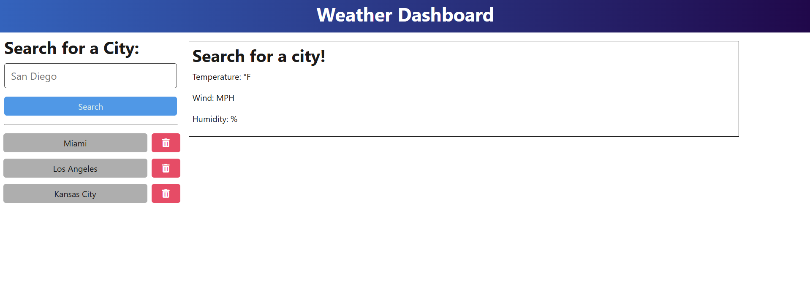
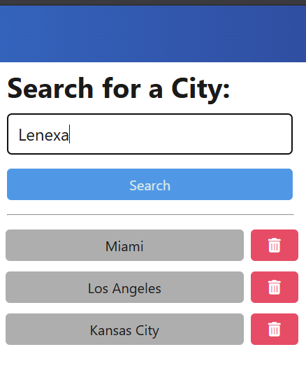
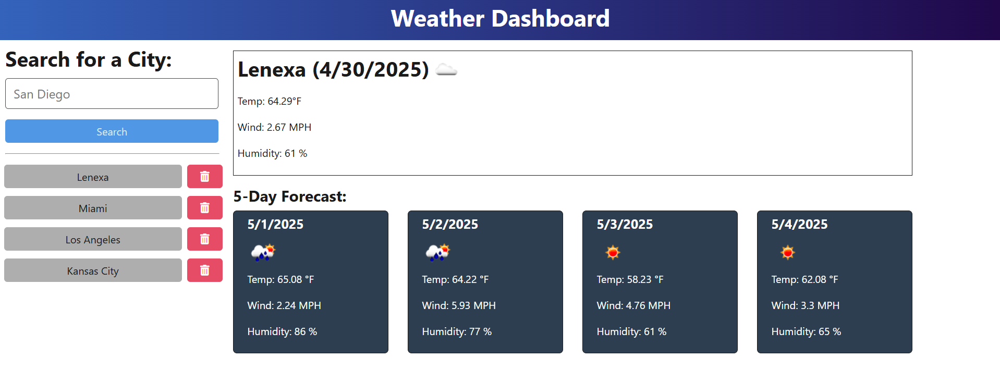
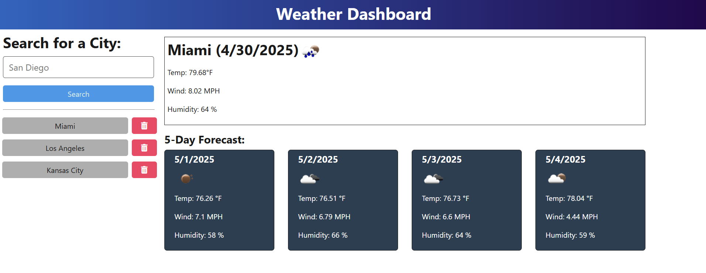

# README
  ;

  ## Description

  A web application allowing users to look up weather conditions in a given city. The user may search cities, revisit previously searched cities, and delete saved cities. The application will provide current conditions and a five day forcast.

  ## Table of Contents

  - [Installation](#installation})
  - [Usage](#usage)
  - [License](#license)
  - [Contributing](#contributing)
  - [tests](#tests)
  - [Questions](#questions)

  ## Installation

  N/A

  ## Usage
  Navigate to the application at [Weather Dashboard](https://zero9-weather-dashboard-m2ib.onrender.com/).
  
  
  To search enter a city into the search bar and either click submit or press enter.
  

  
  
  To use a previously viewed city you may press the automatically generated button in the listand to delete a saved city use the trash icon.
  

  ## Apache 2.0 License

  Copyright 2025 Jacob Peterson

        Licensed under the Apache License, Version 2.0 (the "License");
        you may not use this file except in compliance with the License.
        You may obtain a copy of the License at

        http://www.apache.org/licenses/LICENSE-2.0

        Unless required by applicable law or agreed to in writing, software
        distributed under the License is distributed on an "AS IS" BASIS,
        WITHOUT WARRANTIES OR CONDITIONS OF ANY KIND, either express or implied.
        See the License for the specific language governing permissions and
        limitations under the License.

  https://www.apache.org/licenses/LICENSE-2.0

  ## Contributing

  N/A

  ## Tests

  N/A

  ## Questions

  For questions please contact us at https://github.com/Jpeterson1118 or at Peterson.jacob13@prontomail.com.

